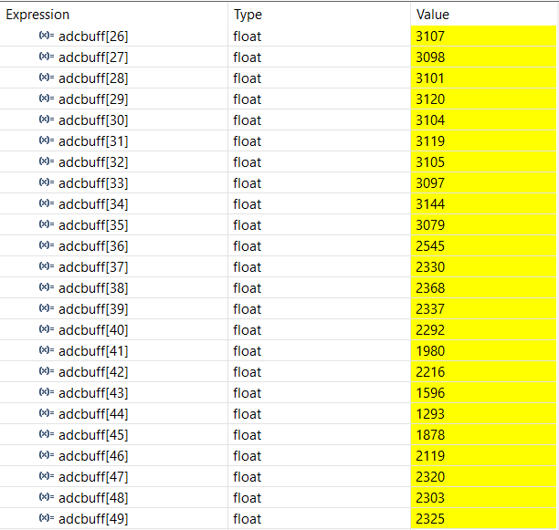
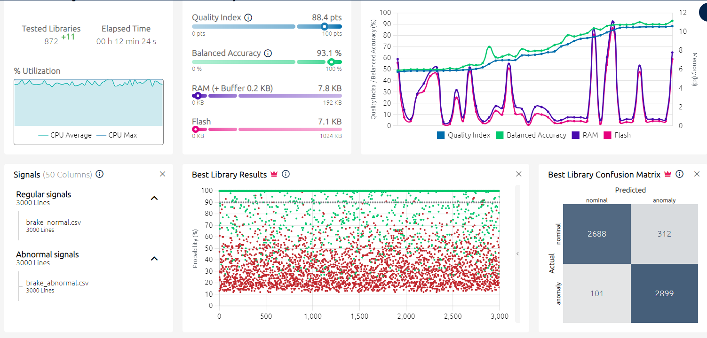
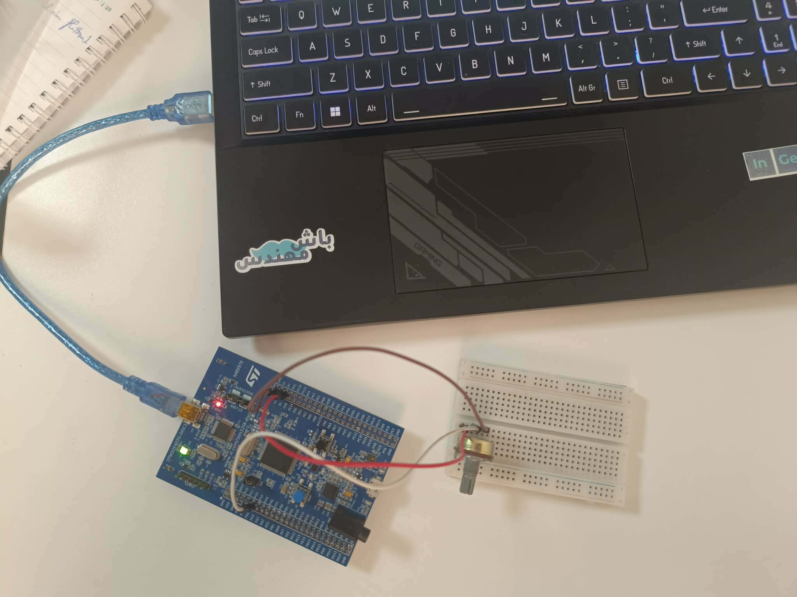
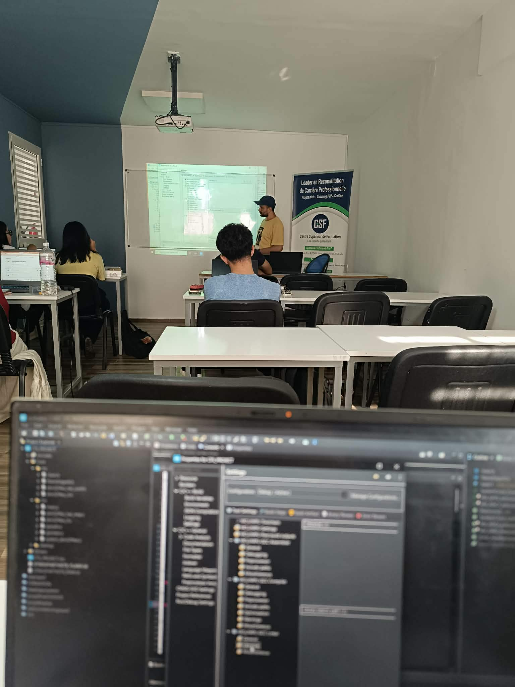

# Anomaly Detection Project for STM32

This project implements an embedded anomaly detection system for a brake-related signal on an STM32 microcontroller. It combines a real ADC acquisition pipeline with a NanoEdgeAI-generated anomaly detection model to continuously evaluate whether the current signal is within the learned normal behavior or deviates toward an abnormal condition.

The repository contains:

- the STM32 firmware for data acquisition and inference,
- a trained anomaly detection model generated for the STM32F407G-DISC1,
- example nominal and abnormal brake datasets,
- generated NanoEdgeAI model artifacts and preprocessing configuration.

## Project goal

The main objective is to detect abnormal behavior in a physical signal without relying on a cloud service or a high-power processor. The system samples an analog signal, stores the last window of samples, and runs an anomaly-detection model directly on the STM32 board.

In this project, the signal is treated as a brake-related monitoring signal, and the model learns the nominal operating behavior from normal data and then flags abnormal deviations.

## Hardware

- Board: STM32F407G-DISC1
- MCU: STM32F407VGT6 (Cortex-M4)
- ADC: ADC1, Channel 1
- Development environment: STM32CubeIDE / HAL-based firmware

## Software stack

- STM32 HAL drivers
- C firmware generated in STM32CubeIDE
- NanoEdgeAI Studio anomaly detection library
- Python emulator utilities for NanoEdgeAI models

## Repository structure

```text
Anomaly_detection_project_STM32/
├── readme.md
├── data/
│   ├── brake_normal.csv
│   └── brake_abnormal.csv
├── figures/
├── models/
│   └── libneai_anomaly-detection-project-stm-_1/
│       ├── NanoEdgeAI.h
│       ├── metadata.json
│       ├── for_llms.txt
│       ├── artifacts/
│       │   ├── icm_model_params.json
│       │   ├── icm_preprocessing_config.json
│       │   └── icm_preprocessing_params.json
│       └── emulators/
│           ├── nanoedgeai_studio_emulator.py
│           └── README.md
└── STM_IDE_code/
    ├── AD STM.ioc
    ├── AD STM.launch
    ├── Core/
    │   ├── Inc/
    │   └── Src/
    ├── Debug/
    ├── Drivers/
    ├── STM32F407VGTX_FLASH.ld
    └── STM32F407VGTX_RAM.ld
```

## Visual results and project setup

The following images show the experimental setup, signal output, and model training results for the anomaly detection system.

### ADC output and signal behavior



### Model training performance



### Hardware and experimental setup






## How the embedded application works

The firmware in `STM_IDE_code/Core/Src/main.c` does the following:

1. Initializes the STM32 HAL and ADC1.
2. Configures a sliding buffer named `adcbuff` with 50 samples.
3. Reads one ADC value at a time using `ADC_Update()`.
4. Shifts the buffer and adds the latest sample.
5. Runs the anomaly detection model every 500 ms:

```c
neai_anomalydetection_init(1);
...
ADC_Update();
HAL_Delay(500);
neai_anomalydetection_detect(adcbuff, &sim);
```

The function `neai_anomalydetection_detect()` evaluates the current signal window and returns a similarity score in `sim`. This score is used to determine whether the current sample pattern resembles the normal learned behavior or looks anomalous.

## Data and model

The project includes brake-related datasets:

- `data/brake_normal.csv` : nominal operating data
- `data/brake_abnormal.csv` : abnormal or degraded operating data

These datasets were used to train a NanoEdgeAI anomaly-detection model tailored for the target STM32 MCU. The generated model metadata indicates:

- algorithm type: anomaly detection
- target MCU: STM32F407G-DISC1
- 50-sample input window
- learning data: 3000 nominal + 3000 anomaly samples in the generated model dataset
- estimated memory footprint: around 7.8 kB RAM and 7.0 kB flash for the generated library

The generated NanoEdgeAI assets show a preprocessing chain based on:

- detrending,
- absolute value transformation,
- pooling,
- interleaving.

This is common for time-series anomaly detection, where the model focuses on relevant signal patterns rather than raw amplitude only.

## NanoEdgeAI library details

The generated library files in `models/libneai_anomaly-detection-project-stm-_1` include:

- `NanoEdgeAI.h` : NanoEdgeAI C API for the anomaly detection model
- `metadata.json` : metadata about training, target MCU, and performance
- `artifacts/*.json` : preprocessing and model parameter definitions
- `emulators/nanoedgeai_studio_emulator.py` : script to run or validate the model in a PC environment

The emulator is useful for testing the generated library outside the microcontroller, especially when validating the model or exploring how the detector works on CSV input.

## Build and run

1. Open `STM_IDE_code` in STM32CubeIDE.
2. Ensure the project is configured for the STM32F407G-DISC1 board.
3. Build the firmware.
4. Flash the program to the board.
5. Connect the analog signal source to ADC1 channel 1.
6. Observe the behavior of the model in the running application.

> The current firmware continuously samples and evaluates the signal; the result is stored in the `sim` variable. At this point, the project is mainly focused on the anomaly detection loop rather than a full user interface or alert system.

## Recommended next steps

- Connect a real sensor or signal generator to ADC1.
- Add output logic such as LEDs, buzzer activation, or a serial message when the similarity drops below a threshold.
- Tune the buffer length (`NSAMPELS`) and update timing to match the physical signal.
- Retrain the NanoEdgeAI model with additional data if the application environment changes.
- Add threshold-based decision logic to convert the similarity value into a clear normal/abnormal alarm state.

## Notes

This project is a good example of how to deploy lightweight AI directly on an embedded MCU. It demonstrates the core workflow for:

- collecting signal data,
- learning normal behavior,
- generating an embedded edge model,
- running inference on a microcontroller in real time.

It is especially useful for low-cost predictive maintenance, fault detection, and signal-monitoring applications where edge inference is preferred over cloud processing.

## License

The project includes STM32 HAL and generated library materials from ST and NanoEdgeAI Studio. Please review the licensing terms of the included vendor files before redistribution or commercial use.
